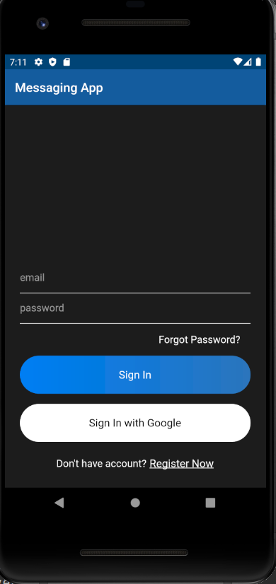
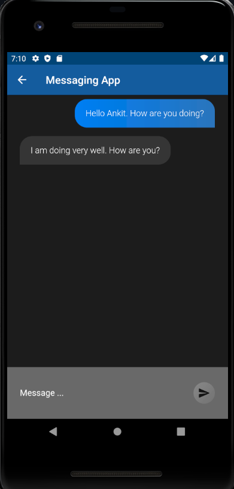
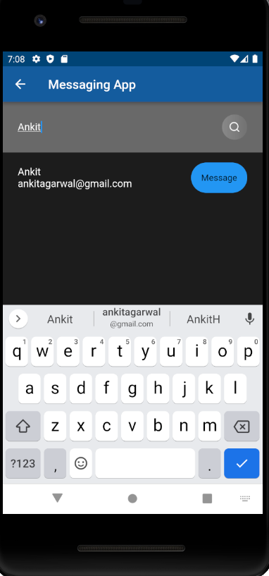

# Messaging App

## Description:
- This app is a Flutter based text messaging app that allows users to communicate in a secure environment through End-to-End Encryption. All the chats are encrypted and decrypted using **Advanced Encryption Standard(AES) Algorithm**. Users can easily register or login using their email address and then chat with anyone without the fear of privacy breaches.

## Features:
- Clean and Simple UI.
- Dark Theme.
- Used Google Firebase for authentication and storing messages.
- Register and Log In using email and password.
- Add and Search users by username
- Real-time send and receive messages using stream in Firebase Firestore database and AES Algorithm

## To be Implemented:
- Forgot Password
- Google Sign In

## Screenshots:

|     |     |
| :-: | :-: |
| Sign In | Sign Up |
|   | 
| Chat Room | Chat Page |
|   | 
| Search |
|  

